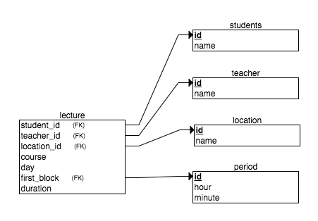
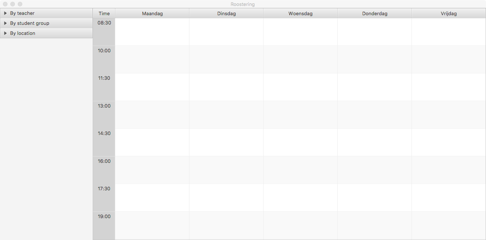
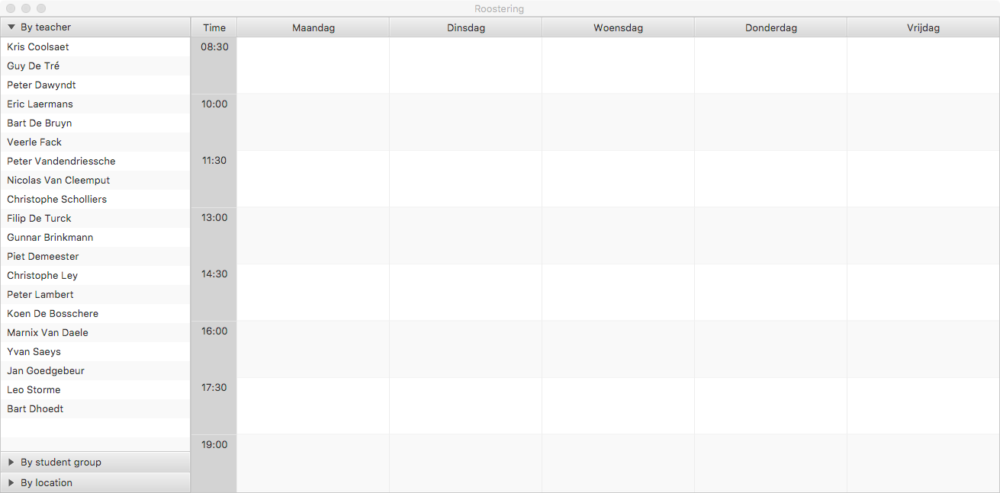
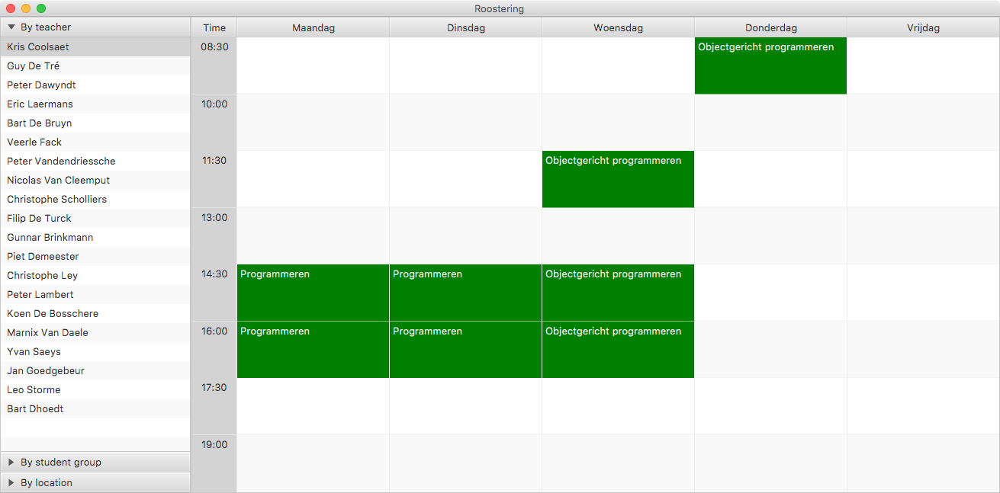
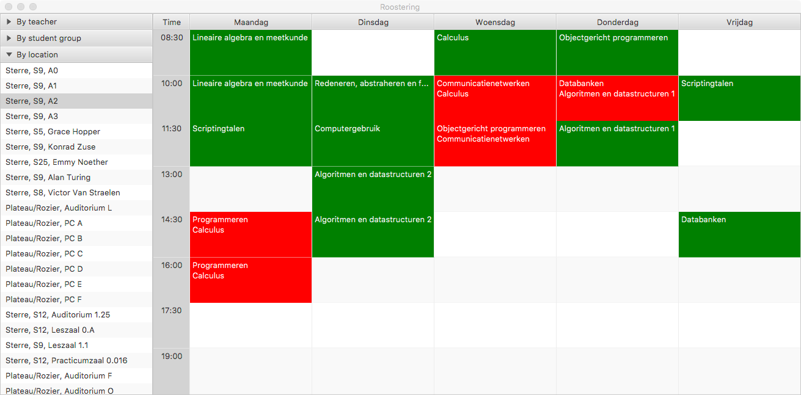

# Lessen roosteren

Een groot deel van de evaluatie voor het vak Objectgericht Programmeren wordt toegekend aan een programmeerproject (8 van de 20 punten). Hoewel iedereen dezelfde opgave krijgt, word je toch verondersteld deze opgave **individueel** op te lossen. Het delen van code zal bij alle partijen betraft worden.

We voorzien de volgende planning

- **woensdag 14 maart**: Het eerste deel van de projectopgave wordt besproken in de oefeningenles.
- **woensdag 28 maart**: Het tweede deel van de projectopgave wordt besproken in de oefeningenles.
- **zondag 8 april**: Uiterste indiendatum van het eerste deel van het project.
- **zondag 6 mei**: Uiterste indiendatum van het tweede deel van het project.
- Inhaalweek: peer review
- Later kan je eventueel nog uitgenodigd worden voor een mondelinge verdediging.

## Inleiding

Voor het project is het de bedoeling dat jullie een applicatie ontwikkelen met behulp van JavaFX die toelaat om lessenroosters weer te geven en aan te maken. Hiervoor zal er gebruik gemaakt worden van een [SQLite](https://sqlite.org/index.html) databank waarvan de structuur in onderstaande afbeelding gevonden kan worden. Een SQLite script dat zo'n databank aanmaakt en opvult kan je [hier](lectures.sql) vinden. De databank aanspreken doe je met de [SQlite JDBC Driver](https://github.com/xerial/sqlite-jdbc).

Er zijn in totaal 5 tabellen. De tabellen `students`, `teacher` en `location` spreken voor zich. Deze bevatten een unieke identifier en respectievelijk de naam van een studentengroep (bv "Bachelor Informatica 1"), de naam van een lesgever (bv "Kris Coolsaet") en de naam van een leszaal (bv "Sterre, S9, A0"). De tabel `period` bevat naast een unieke identifier een tijdstip waarop een lesblok kan starten. Deze zijn bijvoorbeeld 8u30, 10u, 11u30, 13u, 14u30, 16u en 17u30, maar kunnen ook andere periodes bevatten.

De tabel `lecture` is de belangrijkste en bevat voor ieder vak de tijdstippen waarop het gegeven wordt. De datavelden `students_id`, `teacher_id` en `location_id` zijn foreign keys die respectievelijk aangeven aan welke studentengroep het vak gegeven wordt, wie de lesgever van het vak is en in welk lokaal het vak gegeven wordt. `course` bevat de naam van het vak en `day` is een getal van 1 tot 6 die de dag van de week waarop het vak gegeven wordt bevat (maandag is 1, dinsdag 2, ...). `first_block` bevat een verwijzing naar de `period` tabel en geeft aan wanneer het vak start. `duration` geeft aan hoeveel aaneensluitende lesblokken het vak inneemt.

Het vak "Objectgericht programmeren" van professor Kris Coolsaet (id 1) aan de eerste bachelor informatica (id 1) wordt bijvoorbeeld gegeven op woensdag van 11u30 tot 13u in auditorium A2 (id 3), op woensdag van 14u30 tot 17u30 in PC-zaal Hopper (id 5) en op donderdag van 8u30 tot 10u in auditorium A2 (id 3). Dat betekent dat de databank volgende entries zal bevatten.

| students_id | teacher_id | location_id | course                     | day | first_block | duration |
| ----------- | ---------- | ----------- | -------------------------- | --- | ----------- | -------- |
| 1           | 1          | 2           | Objectgericht programmeren | 3   | 3           | 1        |
| 1           | 1          | 5           | Objectgericht programmeren | 3   | 5           | 2        |
| 1           | 1          | 2           | Objectgericht programmeren | 4   | 1           | 2        |

SQLite databanken worden opgeslagen in een gewone file. Je mag ervan uitgaan in deel 1 dat deze file altijd dezelfde naam zal hebben en altijd in het hoofd package van je project zal staan (op indianio maken wij `src/timetable/lectures.db` aan, dus naast `Main.java`).

## Deel 1: Lessenrooster weergeven

Voor het eerste deel van het project moet je de visualisatie van de data uit de databank schrijven. Hierbij moet het mogelijk zijn om het lessenrooster van 1 enkele groep studenten, van 1 lesgever en van 1 locatie weer te geven in een rooster dat bestaat uit 5 kolommen (voor de dagen maandag-vrijdag) en een vast aantal rijen (1 voor ieder lesblok). Het lege rooster kan er dan bijvoorbeeld als volgt uitzien.

In de linkerbalk heb je de mogelijkheid om te zoeken op leerkracht, studentengroep en locatie.

Wanneer een lesgever, studentengroep of locatie geselecteerd wordt, moet het lessenrooster horende bij dat item weergegeven worden. Dat doe je door ieder vak in het rooster op te vullen met de naam van het vak dat dan gegeven wordt. Zorg dat het visueel duidelijk is wanneer een les gegeven wordt.

Wanneer er een conflict is (er worden twee vakken op hetzelfde moment gegeven), moeten alle vakken op dat tijdstip in het rooster verschijnen. Zorg dat het visueel duidelijk is dat er op dat moment een conflict is.

### Programma-aanroep

Eén van de manieren om jouw programma op te starten is via de commandolijn. Hierbij spreken we volgende interface af:

- Als jouw programma aangeroepen wordt zonder argument, start het programma normaal op en is het rooster initieel leeg.
- Als jouw programma wordt opgeroepen met één argument is dat argument altijd ofwel `students` ofwel `teacher` ofwel `location`. Je programma moet dan respectievelijk een lijst van alle studentengroepen, lesgevers of locaties in de databank uitschrijven naar stdout.
- Als jouw programma wordt opgeroepen met twee argumenten is het eerste argument terug `students`, `teacher` of `location`. Het tweede argument is dan respectievelijk ofwel een studentengroep, een lesgever of een locatie. Je programma moet dan het bijhorende rooster tonen in de applicatie.
- Als er een derde agument bijkomt moet er een screenshot van het bijhorende rooster genomen worden die opgeslagen wordt in PNG-formaat in het bestand aangegeven door het derde argument. Vervolgens sluit je het programma af.

Voor het nemen van een screenshot van een bepaalde *scene* of *node* kan je de ingebouwde [snapshot](https://docs.oracle.com/javase/8/javafx/api/javafx/scene/Scene.html#snapshot-javafx.scene.image.WritableImage-) functionaliteit van JavaFX gebruiken, in combinatie met de [SwingFXUtils](https://docs.oracle.com/javase/8/javafx/api/javafx/embed/swing/SwingFXUtils.html#fromFXImage-javafx.scene.image.Image-java.awt.image.BufferedImage-) en de [ImageIO](https://docs.oracle.com/javase/8/docs/api/javax/imageio/ImageIO.html#write-java.awt.image.RenderedImage-java.lang.String-java.io.File-).

In alle andere gevallen moet er een gepaste foutboodschap uitgeschreven worden.

## Deel 2: Lessenrooster opstellen

Voor het tweede deel van de opgave voeg je functionaliteit aan je applicatie toe die het mogelijk maakt om lessenroosters op te stellen. We verwachten dat minstens de volgende functionaliteit aanwezig is:

- Openen van een bestaand databankbestand (extensie `.db`)
- Creëren van een nieuw, initiëel leeg lessenrooster
- Toevoegen van lesgevers, studentengroepen en leszalen
- Toevoegen van een les (entry in tabel `lecture`)
- Aanpassen namen van lesgevers, studentengroepen en leszalen
- Wijzigen van een les
- Verwijderen van een les

Bij het creëren van een nieuw lessenrooster moet de gebruiker de starttijden van de lesblokken kunnen ingeven (tabel `period`). De mogelijkheid om lesgevers, studentengroepen en leszalen te verwijderen moet niet verplicht voorzien worden. Als je dit wel zou willen doen, denk dan goed na over wat er moet gebeuren met de lessen van die lesgevers, studentengroepen en leszalen. 

De manier waarop bovenstaande acties uitgevoerd kunnen worden mag je zelf kiezen, maar zorg ervoor dat dit op een **gebruikersvriendelijke en intuïtieve** manier kan gebeuren. Als je ervoor zou kiezen om functionaliteit te implementeren die niet direct zichtbaar is in je applicatie of als het niet direct duidelijk is welke acties uitgevoerd moeten worden voor bepaalde functionaliteit, neem je die op in een Help-venster.

Hou rekening met lastige gebruikers. Ga er vanuit dat jouw feedback-peers op alle legale manieren jouw programma zullen aanvallen. Als iemand, bij wijze van voorbeeld, twee lesgevers met dezelfde naam toevoegt, mag jouw programma niet crashen, maar moet het een vriendelijke waarschuwing tonen.

Als je tijd over hebt en je code al perfect is volgens jou, kan je mogelijks extra punten verdienen met bijkomende features. Belangrijk hierbij is wel dat wiens verplichte functionaliteit ontbreekt, geen punten kan krijgen voor extra's. Jouw code nog eens nakijken en herschrijven kan ook een stuk meer punten opleveren. Als je toch extra functionaliteit toevoegt, neem deze dan zeker op in een Help-venster zodat diegene die je applicatie test weet dat ze bestaat.

### Programma-aanroep

In het tweede deel hoef je geen speciale aanroep-methoden te voorzien.

## Indienen en specificaties

Het eerste deel moet ten laatste ingedien worden op **8 april** via [Indianio](https://www.indianio.ugent.be). Het tweede deel moet ten laatste ingediend worden op **6 mei**, tevens via Indianio. Hou hierbij rekening met onderstaande opmerkingen:

- Werk verplicht met een packagestructuur.
- Test grondig of de versie die je wil indienen voldoet aan alle opgelegde specificaties.
- Elk bronbestand dat je indient, moet bovenaan je **naam** en **voornaam** bevatten.
- Gebruik Java 8 en JavaFX
- Zorg er voor dat de gebruikte bestanden op een correcte manier worden ingeladen zonder bijvoorbeeld veronderstellingen te maken over het gebruikte besturingssysteem (padnamen, hoofdlettergevoeligheid, ...).

Om in te dienen, maak je een zip bestand van de src-map van je project. Deze map kan je terugvinden door in IntelliJ de volgende stappen te volgen:

- Rechtsklik op de naam van het project
- Klik in het menu op "reveal in Finder" of "reveal in Explorer"
- De src-map van het project zou nu zichtbaar moeten zijn

**Opmerking** Gelieve de "hoofdklasse" (degene die de main methode bevat) van je project `Main` te noemen en deze in de package `timetable` te plaatsen. Als deze momenteel een andere naam en plaats heeft, kan je met behulp van de IntelliJ rename en refactor tools deze eenvoudig aanpassen. Het databestand is `lectures.db`, ook in de map `timetable`.

Bij het indienen op Indianio wordt je code automatisch gecompileerd. Het resultaat van de compilatie is zichtbaar voor jullie, dus als de compilatie niet slaagt, dan verwachten we dat je het probleem oplost en opnieuw probeert in te dienen tot alles correct compileert. Wacht dus niet met indienen tot 5 minuten voor de deadline.

Bij het maken van het vervolg van de opgave is het uiteraard toegelaten om nog wijzigingen aan te brengen aan de klassen die je reeds hebt ingediend. Hou er wel rekening mee dat het eerste deel afzonderlijk zal gequoteerd worden en dat het dus belangrijk is dat alles dan al naar behoren functioneert.

## Peer reviews

Tijdens de inhaalweek krijg je enkele uitvoerbare versies van de andere deelnemers. Je schrijft een beoordeling over het project, met een focus aanwezige/ontbrekende functionaliteit en de algemene bruikbaarheid van het project. Meer informatie volgt bij het uitdelen van de projecten.

## Beoordeling

We hanteren onder andere onderstaande criteria bij de beoordeling van het project:

- Er zal gecontroleerd worden of het project op **strikt individuele** basis gemaakt is; elk gebruik van code van andere studenten zal dan ook bij alle betrokken studenten worden **bestraft**.
- De aangeleerde principes en technieken uit de cursus moeten waar nodig op een correcte manier gebruikt worden in het project.
- De GUI moet verzorgd en overzichtelijk zijn.
- Er worden automatisch punten afgetrokken voor projecten die te laat werden ingediend of niet voldoen aan de vooropgestelde eisen en/of specificaties.
- Het programma mag geen fouten bevatten: het moet foutloos compileren en het mag niet crashen bij de uitvoering.
- De broncode moet leesbaar en overzichtelijk zijn en de toepassing moet een overzichtelijke structuur hebben. Plaats commentaar in de broncode waar nodig, maar overdrijf ook niet. Stukken code die in commentaar staan moeten verwijderd worden uit de broncode!
- Programmeer steeds met efficiëntie in het achterhoofd.
- Programmeer helder en met stijl, gebruik voldoende klassen en methodes (in plaats van knip- en plakwerk), ...
- Indien dit nodig zou blijken, kan je gevraagd worden om je project te komen toelichten. 

## FAQ

### Kan ik online gevonden code/bibliotheken gebruiken in mijn project?

Hangt af van het doel van de code/bibliotheek. We bepalen dit op individuele basis, dus contacteer ons via mail or tijdens een practicum.

### De hoogte van mijn klassen is steeds 0, waar vind ik de echte grootte?

De grootte van JavaFX Pane's wordt pas ingesteld na het renderen ervan. Als je getHeight aanroept tijdens de constructor, zal deze dus nog niet ingesteld zijn. Luister in in plaats daarvan naar de heightProperty om te weten wanneer de hoogte dan wel ingesteld wordt.

